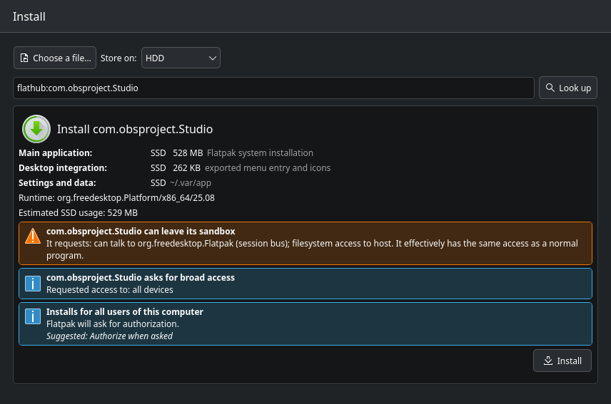
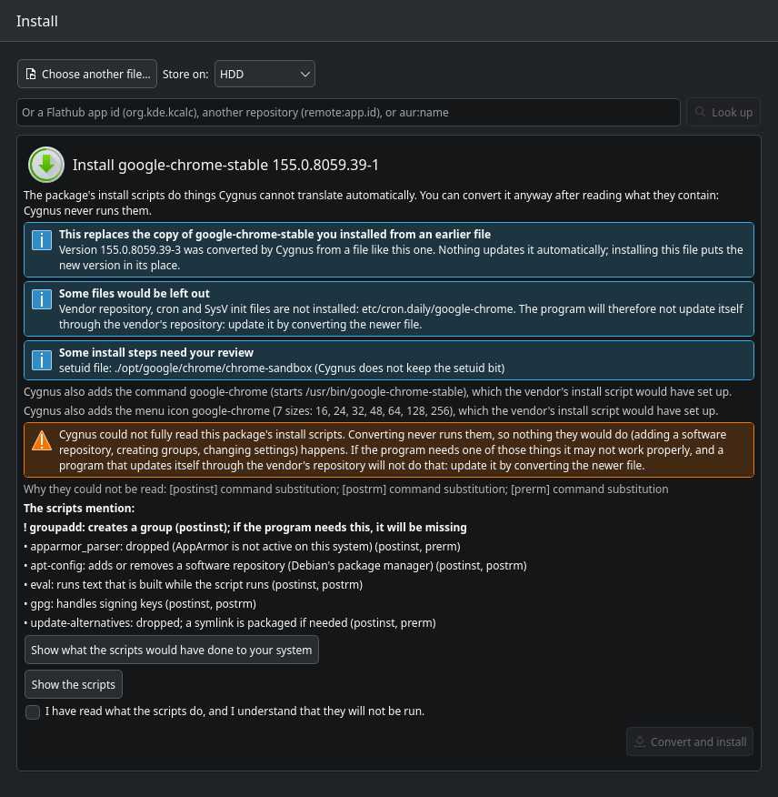
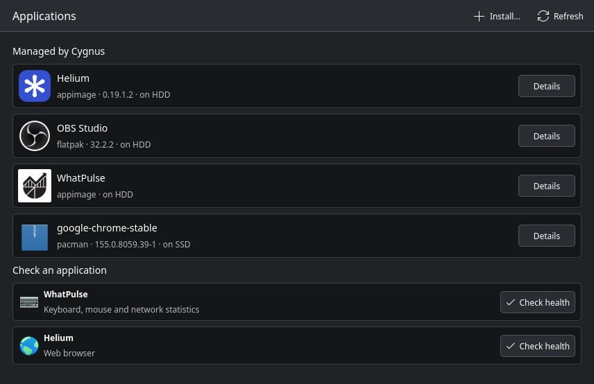
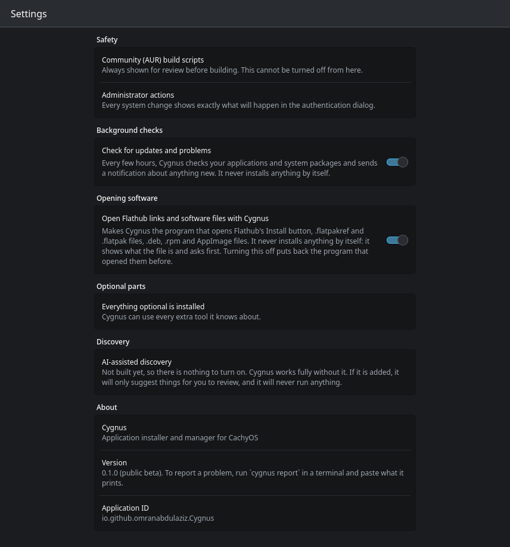

# Cygnus

An application installer and manager for CachyOS / KDE Plasma. You choose where each application
lives (for example SSD or HDD). Cygnus resolves runtimes and dependencies, finds the companion
components an application needs, checks that everything works, and can always finish or undo what
it started.

> **Public beta.** Cygnus works and is used daily by its author, but it has **not had an independent human security review**,
> it has been tested on one setup (CachyOS, KDE Plasma, x86_64), and it contains a small program that runs as
> administrator (the helper) to install and remove packages. Every change to your system shows exactly what it will do
> and asks for your approval first, but treat it as a beta: read the confirmations, keep backups of what matters, and
> please report what you find (see "Reporting a problem" below). The limits are listed in the
> [user guide](docs/user-guide.md#what-cygnus-cannot-do-known-limits); how to review the security-critical part is in the
> [audit guide](docs/audit-guide.md).

* App ID: `io.github.omranabdulaziz.Cygnus`
* License: GPL-3.0-or-later. You can get a ready-made package from [Gumroad](https://azizomran.gumroad.com/l/jtudib) (free during the beta) or build Cygnus yourself.
* Documentation:
  * [User guide](docs/user-guide.md)
  * [Security model](docs/security.md)
  * [Guide for a security audit](docs/audit-guide.md)
  * [Vendor manifest specification (CAM-1)](docs/manifest-spec.md), with its
    [JSON Schema](docs/cam-1.schema.json)
  * [Architecture](docs/architecture-proposal.md)

## Screenshots

**Installing from Flathub:** what it is, how big, what access it asks for, where it goes, and a confirmation before anything happens.



**Converting a vendor's .deb:** what would be left out, what Cygnus adds, and what the vendor's install scripts mention (they are never run; you can read them and see what they would have done).



**Everything Cygnus manages, on the drive you chose:**



**Settings:** background checks, opening Flathub links and software files with Cygnus, and optional tools.



## What works today

| | Install | Update | Uninstall | Move | Repair | Health |
|---|---|---|---|---|---|---|
| AppImage | ✓ copy to a drive, or adopt in place (pinned signatures verified) | ✓ zsync / GitHub, verified | ✓ | ✓ | ✓ | ✓ |
| Flatpak app (by id, e.g. `flathub:org.kde.kcalc`) | ✓ system, or the user installation stored on another drive | ✓ from its remote | ✓ (+ runtimes it brought) | ✓ between installations | ✓ | ✓ |
| Flatpak bundle | ✓ as above; runtime resolved by Cygnus | ✓ if it names a remote | ✓ | ✓ | ✓ | ✓ |
| Local Arch package | ✓ via the privileged helper | with the system | ✓ via the helper | — | — | ✓ |
| AUR | ✓ review → build as you → install via the helper (dependency chains too) | rebuild after reviewing changes | ✓ via the helper | — | — | ✓ |
| DEB / RPM | ✓ convert into a pacman package when safe (shows what the vendor's install scripts would have done; nothing is run); otherwise a native alternative or a refusal | ✓ for 13 known vendors (Chrome, Edge, Brave, Signal, …) and any you add: download, review, replace | ✓ via the helper | — | — | — |

* **Flathub's Install button and software files** can open Cygnus instead of another store (an opt-in switch in
  Settings; it asks first and never installs by itself).
* **System updates** are checked without administrator rights and applied as one full upgrade
  through the helper (never a partial upgrade); a new kernel is pointed out.
* **Background checks** (optional systemd user timer) notify you once about updates, applications
  that stopped working, and operations that did not finish.
* **Interrupted operations** (Cygnus closed, power loss) are listed on the next start, with a choice
  to finish or undo each one. A pacman lock left behind by a crashed package manager can be removed
  safely through the helper.
* **Optional features you do not want** can be switched off, so they are no longer checked or suggested.
* **Components** such as group membership, system services and browser extensions are checked and
  installed from curated manifests (WhatPulse and Helium are included).

## Install

On CachyOS or Arch Linux with KDE Plasma (x86_64):

* **From the AUR** (once published): `yay -S cygnus` (or any AUR helper).
* **Ready-made package:** download `cygnus-0.1.0-1-any.pkg.tar.zst` from [Gumroad](https://azizomran.gumroad.com/l/jtudib)
  (free during the beta), then `sudo pacman -U cygnus-0.1.0-1-any.pkg.tar.zst`.
* **From source:** `git clone https://github.com/AbdulazizOmran/Cygnus && cd Cygnus/packaging/arch && makepkg -si`
  (the build runs the test suite).

Then open **Cygnus** from the application menu (or run `cygnus-gui`). On first use, open **Storage** and add the drive or
folder where applications should live (your home folder works); Cygnus tests what the drive supports before it uses it.
The administrator helper starts by itself when needed and exits when idle; nothing runs in the background unless you
switch on the update checks in Settings.

## Privacy

Cygnus has no telemetry, no account and no crash reporting. It talks to the network only to do what you asked or to check
for updates of what you installed: your distribution's package mirrors (through pacman), `flathub.org` and
`dl.flathub.org`, `aur.archlinux.org`, `api.github.com` / `github.com` (AppImage update information), and the vendor
package lists of programs you converted (for example `dl.google.com`, `packages.microsoft.com`). Everything it stores is in
`~/.local/share/cygnus`, `~/.config/cygnus`, `~/.cache/cygnus` and `~/.local/state/cygnus`, plus the helper's own
record of administrator actions in `/var/lib/cygnus`.

## Reporting a problem

Run `cygnus report` and paste its output into your issue. It lists versions, tools and counts, and leaves out your user
name, your home folder, application names and file names; read it before you post it anyway. For anything that involved
an administrator action, also add `journalctl -t cygnus-helper -n 50`. **Security problems:** please do not open a public
issue; see [SECURITY.md](SECURITY.md).

## Removing Cygnus

In **Settings → Opening software**, switch off the default-program option if you turned it on (it puts back the program that
opened Flathub links before), then `sudo pacman -R cygnus`. Programs you installed through Cygnus stay installed (they are
ordinary pacman packages, Flatpaks and AppImages); Cygnus only forgets them. Its folders listed above can be deleted.

## Requirements (Arch / CachyOS packages)

* **Runtime:**
  * Python and system libraries: `python` (3.14+), `pyalpm`, `python-gobject`, `python-pydantic`,
    `python-requests`, `python-cryptography`, `python-systemd`.
  * Qt and KDE: `pyside6`, `qt6-declarative`, `kirigami`, `kirigami-addons`, `qqc2-desktop-style`.
  * Tools: `flatpak`, `ostree`, `squashfs-tools`, `libarchive`, `binutils`, `gnupg`, `util-linux`,
    `polkit`, `systemd`, `pacman`, `desktop-file-utils`, `libnotify`, `git` (AUR build files),
    `fakeroot` (makepkg, the system-update check and the package file lists), `xdg-utils` (opening store
    pages, and the switch that makes Cygnus the default program for software files) and `glib2` (`gio`,
    which reads that default).
  * Optional: `base-devel` (the compilers and build tools AUR packages need to build from source),
    `kservice` (refresh the Plasma menu at once), `fuse2` / `fuse3` (run AppImages that need them),
    `zsync` (delta downloads for AppImage updates).
* **Build:** `python-build`, `python-installer`, `python-setuptools`, `python-wheel`.
* **Tests:** `python-pytest`.

The in-tree package recipe is [`packaging/arch/PKGBUILD`](packaging/arch/PKGBUILD).

## Using it from a checkout

```sh
python3 -m cygnus.gui.app                 # the application (or: cygnus-gui once installed)
python3 -m cygnus doctor                  # check the environment
python3 -m cygnus storage scan            # filesystems that could hold applications
python3 -m cygnus storage add /mnt/data --label HDD --apps-dir apps/CachyOS
python3 -m cygnus install ~/Downloads/App.AppImage --to HDD
python3 -m cygnus install flathub:org.kde.kcalc --to HDD   # Flatpak app by id
python3 -m cygnus aur review pfetch               # read the build files (nothing runs)
python3 -m cygnus aur install pfetch              # build as you, install via the helper
python3 -m cygnus install ~/Downloads/tool.deb    # converted when safe
python3 -m cygnus adopt ~/Applications/Existing.AppImage
python3 -m cygnus check WhatPulse         # health of every installed copy
python3 -m cygnus updates --check            # applications and system packages
python3 -m cygnus upgrade                    # update the whole system through the helper
python3 -m cygnus watch --enable             # background checks with notifications
python3 -m cygnus dismiss WhatPulse web-insights   # an optional feature you do not want
python3 -m cygnus move App --to SSD
python3 -m cygnus repair App
python3 -m cygnus recover                 # interrupted operations (--pacman-lock: a stale pacman lock)
python3 -m cygnus uninstall App
```

Commands that install, remove, repair, move or update software show what they will do and ask
first; `--yes` skips the question. Settings-style commands (`storage add/remove/set-default`,
`dismiss`, `watch --enable/--disable`) take effect at once and can be undone the same way.

## Development

```sh
python3 -m pytest
```

The tests never write outside their temporary directories:
* the XDG, runtime and Flatpak user and system directories are redirected per test;
* signing keys use throwaway GnuPG homes;
* the GUI smoke test renders offscreen.

`tests/builders.py` generates fixture packages of every format, plus signed Flatpak repositories.
